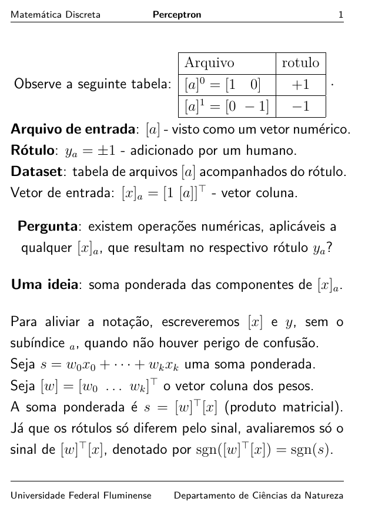
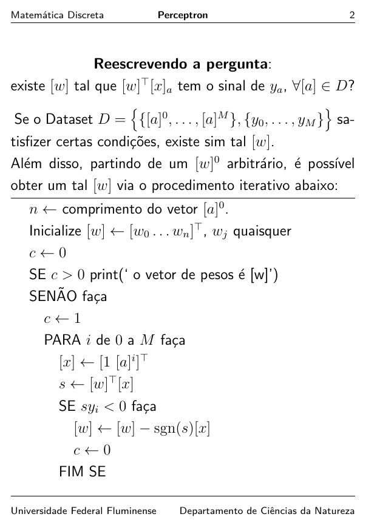
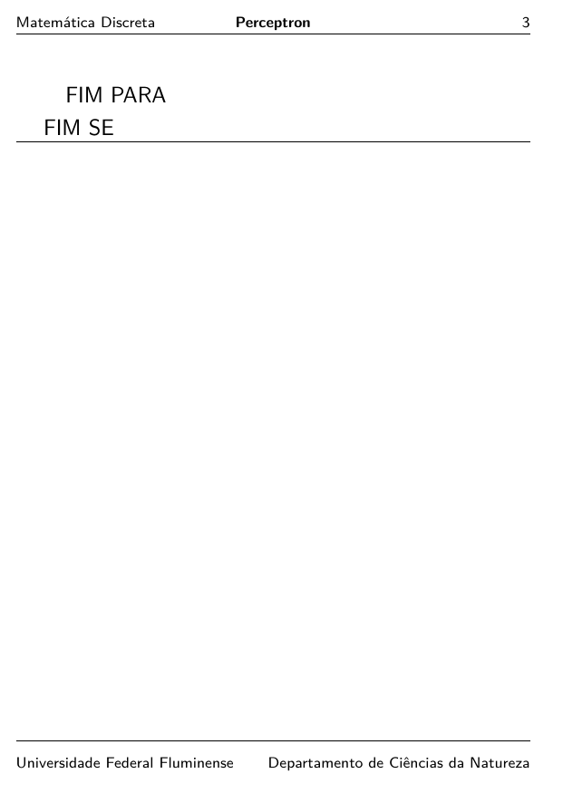

<!-- README.md is generated from README.Rmd. Please edit that file -->

```{r, include = FALSE}
knitr::opts_chunk$set(
  out.width = "100%"
)
```

# Perceptromulo

<!-- badges: start -->
[](https://lifecycle.r-lib.org/articles/stages.html#experimental)
<!-- badges: end -->

## [Clique aqui para executar o aplicativo](http://fnaufel-uff.shinyapps.io/PerceptRomulo)

Desenvolvido no [Departamento de Ciências da Natureza](https://depcienciasdanatureza.uff.br/) pelo [Professor Fernando Náufel](https://fnaufel.github.io/), como material de apoio para a disciplina *Métodos Matemáticos para Aprendizado de Máquina*, ministrada pelo Professor Romulo Rios Rosa na [Universidade Federal Fluminense](https://www.uff.br/).


## Funcionamento de um perceptron 




