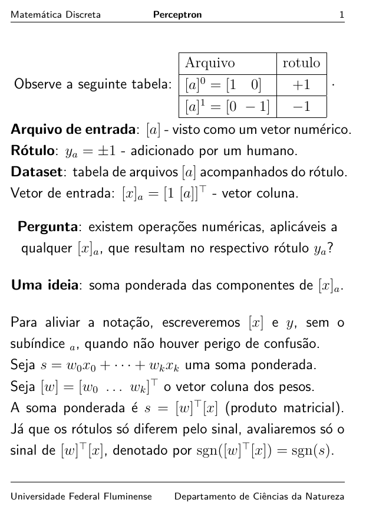

<!-- README.md is generated from README.Rmd. Please edit that file -->

# Perceptromulo

<!-- badges: start -->

<!-- badges: end -->

Desenvolvido no [Departamento de Ciências da
Natureza](https://depcienciasdanatureza.uff.br/) pelo [Professor
Fernando Náufel](https://fnaufel.github.io/), como material de apoio
para a disciplina *Métodos Matemáticos para Aprendizado de Máquina*, do
Professor Romulo Rios Rosa, ministrada na [Universidade Federal
Fluminense](https://www.uff.br/).

## Funcionamento de um perceptron

  
